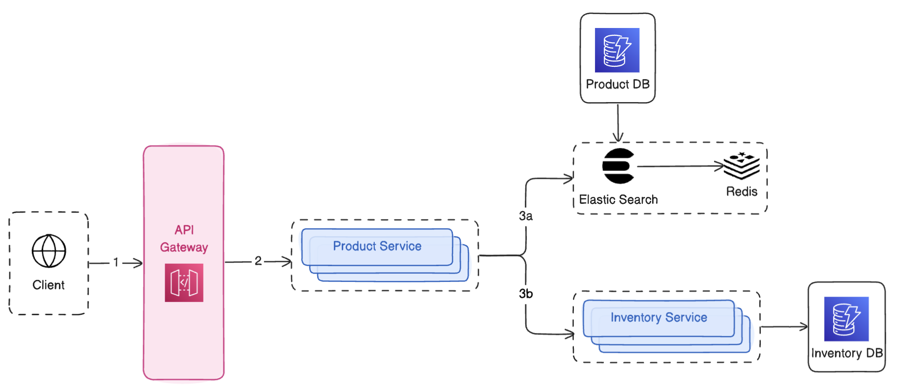
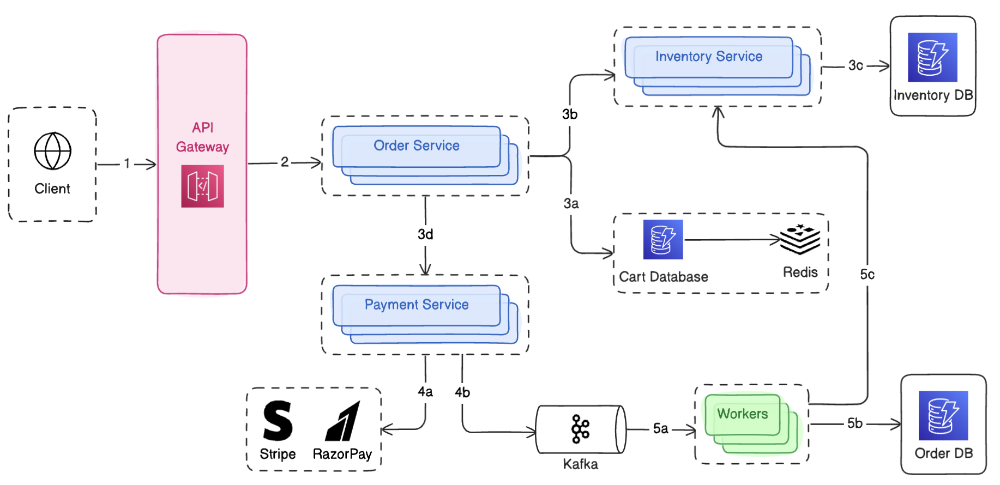
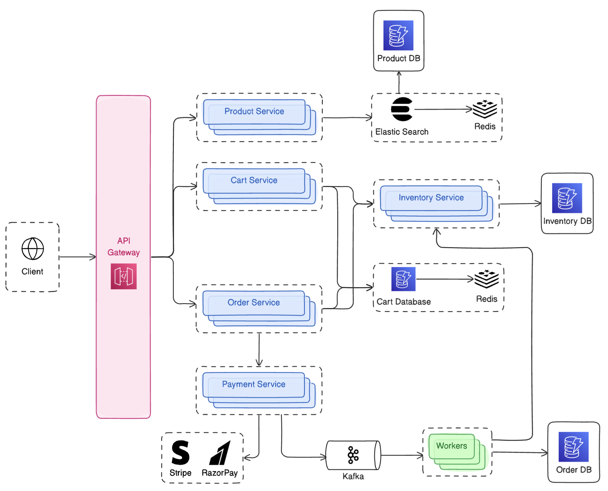

# E-Commerce System Design


## Table of Contents

1. [Problem Statement](#problem-statement)
2. [Functional Requirements](#functional-requirements)
3. [Non-Functional Requirements](#non-functional-requirements)
4. [Back-of-the-Envelope Calculation](#back-of-the-envelope-calculation)
   - [Query Per Second (QPS) Estimation](#query-per-second-qps-estimation)
   - [Storage Requirements](#storage-requirements)
5. [Data Model](#data-model)
6. [API Endpoints](#api-endpoints)
   - [`POST /api/auth/login`](#post-apiauthlogin)
   - [`GET /api/products`](#get-apiproductscategory_id5searchabcpage2limit10)
   - [`POST /api/cart/items`](#post-apicartitems)
   - [`GET /api/orders`](#get-apiorders)
   - [`POST /api/orders/{id}/pay`](#post-apiordersidpay)
7. [High-Level Design](#high-level-design)
   - [Product Browsing Flow](#product-browsing-flow)
   - [Cart Management Flow](#cart-management-flow)
   - [Checkout & Order Placement Flow](#checkout--order-placement-flow)
   - [Complete Architecture](#complete-architecture)

## Problem Statement

Design a scalable E-Commerce application like [Amazon.com](Amazon.com) or [Flipkart.com](Flipkart.com).

## Functional Requirements

1. User Authentication
2. Product Catalog
3. Shopping cart
4. Order management
5. Payment Processing
6. Inventory Management

## Non-Functional Requirements

1. Scalability
2. Performance - Low Latency
3. Availability

## Back-of-the-Envelope Calculation

### Query Per Second (QPS) Estimation

- Assumption: 10M DAU average.
  - Peak Traffic = 2 x average.
- Traffic Breakdown: Mostly browsing/searching (80%) and some checkouts (20%).
- Calculations:

  - 10M DAU x 10 views/day = 100M views/day

  - 100M / 10^5 seconds per day = 10K QPS (average)

  - Peak QPS = 2 x average = 20K QPS

### Storage Requirements

- Assumption: 10M Users, 100M products, 1M orders/day
- Calculations:

  - Users: 10M x 1KB/users = 10^7 x 10^3 = 10^10 = 10GB

  - Products: 100M x 10KB/product = 10^8 x 10^4 = 1TB

  - Orders: 1M/day x 5KB/order x 365 = 2 x 10^12 = 2TB

## Data Model


## API Endpoints

### `POST /api/auth/login`

**Request Body**

```json
{
  "email": "user@gmail.com",
  "password": "12345678"
}
```

**Response Body (200)**

```json
{
  "token": "jwt_access_token",
  "user_id": "user_123"
}
```

### `GET /api/products?category_id=5&search=abc&page=2&limit=10`

List products with filters and pagination.

**Response Body (200)**

```json
{
  "products": [
    {
      "id": 123,
      "name": "Samsung Galaxy Fold 7",
      "price": 89999.0
    }
  ],
  "total": 100
}
```

### `POST api/cart/items`

**Request Body**

```json
{
  "product_id": "prod_123",
  "quantity": 2
}
```

**Response Body (201)**

```json
{
  "message": "Item added to cart"
}
```

### `GET api/orders`

Lists the user’s orders.

**Response Body (200)**

```json
{
  "orders": [
    {
      "id": 123,
      "total_amount": 89999.0,
      "status": "shipped"
    }
  ],
  "total": 100
}
```

### `POST api/orders/{id}/pay`

**Request Body**

```json
{
  "payment_token": "token"
}
```

**Response Body (200)**

```json
{
  "payment_id": 101,
  "status": "completed"
}
```

## High-Level Design

### Product Browsing Flow



### Cart Management Flow


### Checkout & Order Placement Flow



### Complete Architecture


