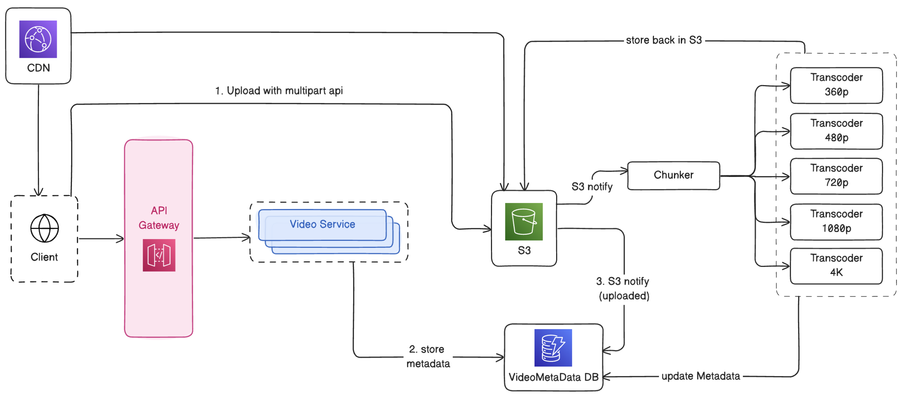

# Video Streaming Platform System Design


## Table of Contents

1. [Problem Statement](#problem-statement)
2. [Functional Requirements](#functional-requirements)
3. [Non-Functional Requirements](#non-functional-requirements)
4. [Back-of-the-Envelope Calculation](#back-of-the-envelope-calculation)
   - [Storage Estimate](#storage-estimate)
5. [API Endpoints](#api-endpoints)
   - [`POST /upload`](#post-upload)
   - [`GET /videosvideoid`](#get-videosvideoid)
6. [High-Level Design](#high-level-design)
   - [Uploading Large Videos](#uploading-large-videos)
   - [Downloading / Streaming Videos](#downloading--streaming-videos)
   - [Transcoding (Different Video Qualities)](#transcoding-different-video-qualities)
   - [Adaptive Bitrate Streaming](#adaptive-bitrate-streaming)
   - [CDN for Faster Delivery](#cdn-for-faster-delivery)
   - [Overall Flow](#overall-flow)

## Problem Statement

Design a scalable Video Streaming and Sharing service like YouTube.

## Functional Requirements

1. Users should be able to upload videos.
2. Users should be able to watch/stream videos.

## Non-Functional Requirements

1. Low latency
2. High availability
3. Highly scalable

## Back-of-the-Envelope Calculation

### Storage Estimate

- Assume DAU = 2B
- Average video upload per day = 0.5% of DAU = 10M videos/day
- Average video size = 100MB
- Daily Storage = 10M x 100MB = 1000 TB/day = 1 PB/day
- Annual video storage = 365 PB/year

## API Endpoints

### `POST /upload`

**Request Body**

```json
{
  VideoMetada
}
```

### `GET /videos/{videoId}`

**Response Body**

```json
{
  VideoMetadata
}
```

## High-Level Design



### Uploading Large Videos

- API Gateway Limit: Can’t handle videos > 10MB.
- Multipart Upload: Client uploads large videos directly to S3 in chunks.
- S3 Stitching: S3 automatically combines chunks into a full video.
- Upload Status Update: S3 triggers a notification to update video metadata (e.g., from “uploading” → “uploaded”). \

### Downloading / Streaming Videos

- Don’t download the full video: Too slow, needs lots of memory, and unstable connections can fail it.
- Use video chunks instead:
  - A Chunker service splits the uploaded video into small clips (2–10 seconds).
  - These small chunks are stored in S3 and listed in the video metadata.
  - The client requests chunks one by one → video starts playing fast

### Transcoding (Different Video Qualities)

- Videos are transcoded into multiple resolutions (e.g., 4K, 1080p, 720p, 240p).
- Each resolution has its own set of chunks.
- Stored back in S3 and referenced in metadata (as lists of chunk URLs).
- Allows playback on different bandwidths and devices.

### Adaptive Bitrate Streaming

- The player monitors the internet speed.
- It switches automatically between video qualities (e.g., from 4K → 720p) if the network slows down.
- Ensures smooth playback without buffering.

### CDN for Faster Delivery

- CDN (Content Delivery Network) stores popular video chunks closer to users.
- Reduces latency and speeds up loading.
- Manifest file: a small file (JSON/XML) listing chunk URLs for each quality.
- The client first downloads the manifest, then fetches the right chunks from the CDN. \

### Overall Flow

1. Client uploads large video → directly to S3 (multipart).
2. S3 finishes upload → sends notification.
3. Chunker splits video → small chunks.
4. Transcoder creates different quality versions.
5. All chunks are stored in S3.
6. Metadata updated with chunk URLs.
7. When the user watches → client fetches manifest + chunks from CDN.
8. Adaptive streaming ensures smooth playback for any network.
