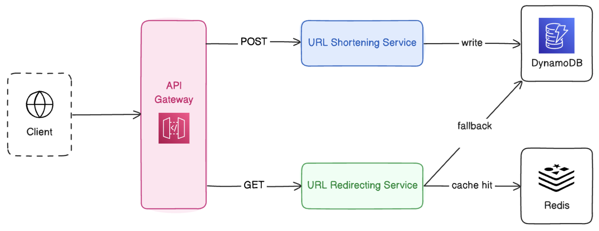
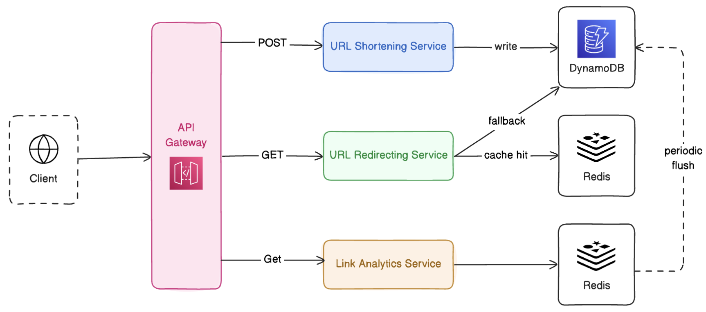

# Table of Contents

- [Problem Statement](#problem-statement)
- [Functional Requirements](#functional-requirements)
- [Non-Functional Requirements](#non-functional-requirements)
- [API Endpoints](#api-endpoints)
- [Database Design](#database-design)
- [High-Level Design](#high-level-design)
  - [URL Shortening](#url-shortening)
  - [URL Redirecting](#url-redirecting)
  - [Link Analytics](#link-analytics)

# Problem Statement

Design a URL Shortener service like [bit.ly](bit.ly)

A URL Shortener is a service that takes a long URL and generates a shorter, unique alias that redirects the user to the original URL.

The system should be able to handle millions of URLs, allowing users to create, store, and retrieve shortened URLs efficiently.

# Functional Requirements

1. URL Shortening - pass in a long URL and shorten it.
2. URL Redirection - Accessing the short URL should redirect to the original URL with minimal delay.
3. Link Analytics - Count the number of times the short URL is accessed.

# Non-Functional Requirements

1. Minimize redirect latency
2. Assuming 100M DAU, Read-write ratio = 100:1
   1. 100M \* 10 Read requests per day = 10^9 / 10^5 = 10K Req/sec
   2. 1M write requests per day.
3. High availability

# API Endpoints

### `POST /api/url/shorten`

Shorten a given long URL and return the shortened URL.

**Request Body**

```json
{
  "longURL": "http://example.com/random/page?random=true"
}
```

**Response Body**

```json
{
  "shortURL": "http://shorty.ly/abc"
}
```

### `GET /api/url/{shortURL}`

Redirect to the original long URL using the shortened URL.

**Response Body**

```json
{
  "longURL": "http://example.com/random/page?random=true"
}
```

# Database Design

## SQL vs NoSQL

- Need to store billions of records.
- Simple key-value lookups.
- Highly read-intensive
- No need for joins and ACID
- DB should be highly scalable and available

Keeping these points in mind, we can go for a NoSQL database like **_DynamoDB_**.

## Database Schema

**ShortURL**

| Field Name | Type   | Key         | Description               |
| ---------- | ------ | ----------- | ------------------------- |
| short_url  | string | Primary Key | Shortened unique URL code |
| long_url   | string |             | Original (long) URL       |
| user_id    | string | Foreign Key | Creator/User ID           |
| used_count | number |             | Number of times accessed  |
| created_at | date   |             | Timestamp of creation     |

# High-Level Design

## URL Shortening

- The backend service receives the requests, and it should create a short URL for the given long URL.
- The mapping of the short URL to the long URL should be stored in a highly available database, such as DynamoDB.


## URL Redirecting

- Split into two services - shortening and redirecting.
- The API Gateway acts as an entry point, routing POST requests to the URL Shortening service and GET requests to the URL Redirecting Service.
- The redirection service accepts the short URL, fetches it from the Redis cache, and responds with a 302 Found Status code.
- If a cache miss, fetch it from the DynamoDB and also save it in the cache.



## Link Analytics

- When a GET request for the Redirecting service is made, a private GET request to the link analytics service is made by the API Gateway.
- The link analytics service will keep a visit frequency count of the short URL in the in-memory or Redis.
- After a period of time, say 60 seconds, the visit frequency of every short URL will be flushed and updated in DynamoDB.


